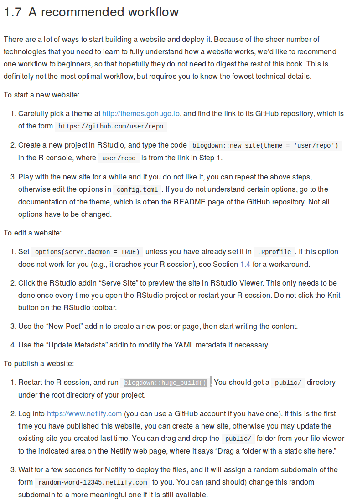
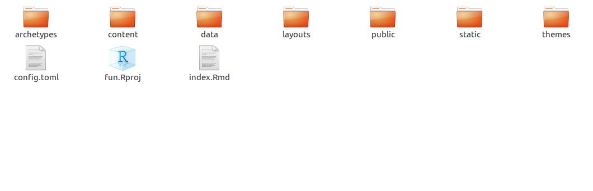
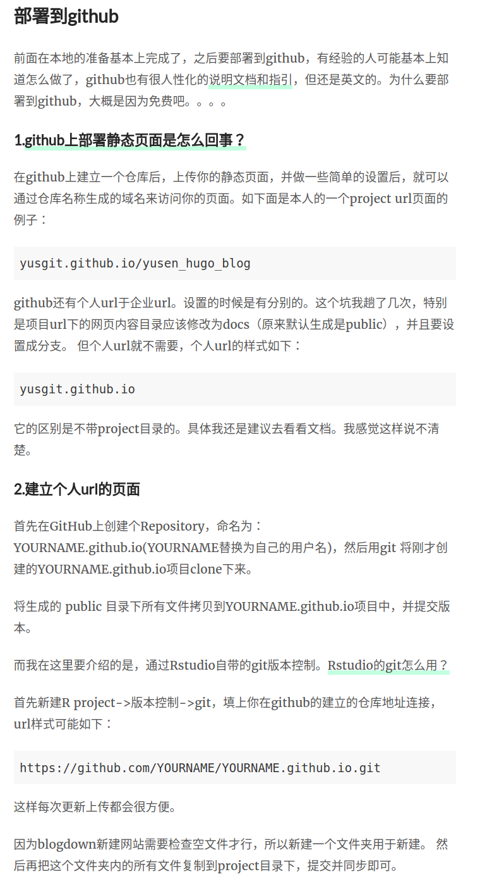
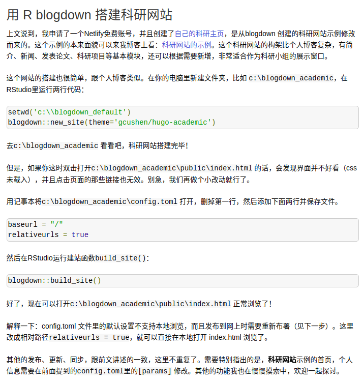

```{r setup,eval=TRUE, echo=FALSE, warning=FALSE,message=FALSE}
knitr::opts_chunk$set(eval = FALSE, echo = TRUE, message = FALSE, warning = FALSE)
```


这个文件用于介绍 blogdown 的使用！

# End to end

参考资料 https://bookdown.org/yihui/blogdown/

1. In R console `blogdown::new_site()`, 你就会在本地建立一个网站。

2. 将网站配置到 netlify.com上 `blogdown::hugo_built()`.


> 参考工作流程 

https://bookdown.org/yihui/blogdown/workflow.html

简单来说就是先建立一个网站，然后再发布网站！

    ----------------------------------------------------------------
    # Start a new website
    1. Carefully pick a theme at http://themes.gohugo.io, and find the link to its GitHub repository
    2. Create a new project in RStudio, and type the code blogdown::new_site(theme = 'user/repo')
    -----------------------------------------------------
    # Publish a website
    1. Restart the R session, and run blogdown::hugo_build(). 
    You should get a public directory under the root directory of your project.
    2. Log into https://www.netlify.com.  
    You can drag and drop the public/ folder from your file viewer to the indicated area on the 
    Netlify web page, where it says “Drag a folder with a static site here.”
    3. Wait for a few seconds for Netlify to deploy the files, and it will assign a random subdomain 
    of the form random-word-12345.netlify.com to you. You can (and should) change this random subdomain
    to a more meaningful one if it is still available.


# Quick start

直接来一张详细的图形吧！


> test some changes 1


> test some changes 2


> test some changes 3


> test some changes 4




> test some changes 5




# 详细讲解

## FAQ

1. 如何更新博客上的文章呢？

- 一个能够绕过去的方法是使用 git!
- 然而可以直接托到相应位置


## Introduction to files


网站的语言，网站标题，作者等等n多配置，有特别需求一定要看hugo的文档说明才行。虽然也有很多地方没有说明白的，对于小白是看的很痛苦。例如layouts这个文件，是用来存放网页外观设置的html，默认在主题里面，如果要自己配置一些自定义，还要懂一些文档里提到的一些语法。

## Materials

- http://dapengde.com/archives/19304

- http://www.yasasa.cn/2017/03/11/how-to-make-hugo-blog-on-github/








